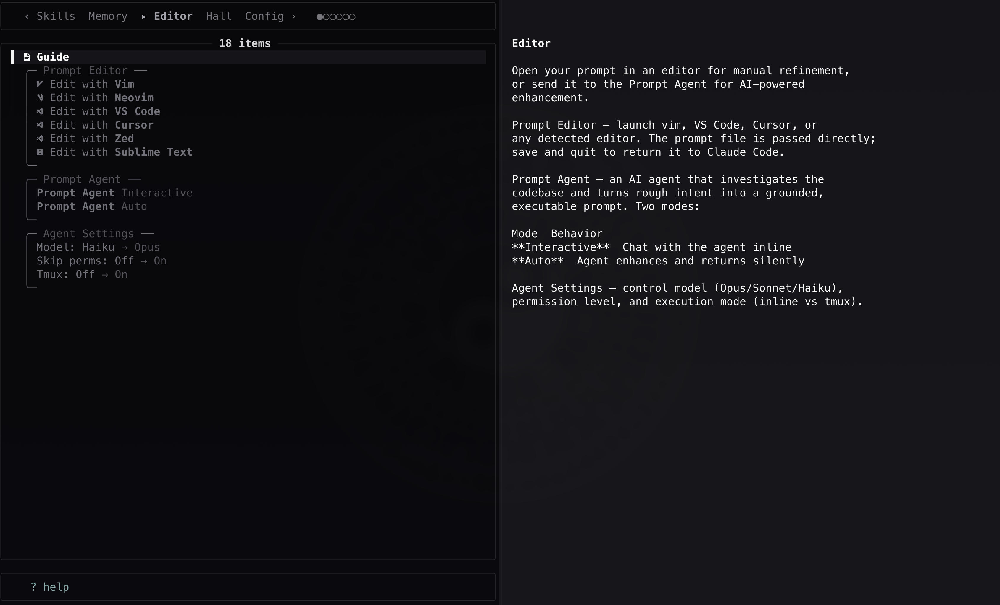

# cc-hall 🏛️

Extensible power menu for Claude Code



cc-hall is a control panel that can host mods directly in your Claude Code. It ships with modules for editing prompts, toggling hidden settings, browsing skills, and managing memory files.

Ctrl-G fires the EDITOR hook which used to open your prompt in an editor. cc-hall hijacks it to render a fzf menu.

## Install

```bash
curl -fsSL https://raw.githubusercontent.com/pro-vi/cc-hall/master/install.sh | bash
```

Or clone locally:

```bash
git clone https://github.com/pro-vi/cc-hall.git
cd cc-hall && ./install.sh
```

**Required:** [fzf](https://github.com/junegunn/fzf) (0.40+), [tmux](https://github.com/tmux/tmux), [bun](https://bun.sh)

**Recommended:** [glow](https://github.com/charmbracelet/glow) (markdown preview), [Nerd Fonts](https://www.nerdfonts.com/) (richer icons)

The installer symlinks `cc-hall` to `~/.local/bin/` and registers it as `EDITOR` in Claude Code settings.

```bash
./install.sh          # install
./install.sh check    # verify (if supported)
```

## Tests

The Bats test harness is vendored as git submodules. Initialize them before running the suite:

```bash
git submodule update --init --recursive
./tests/bats/bin/bats tests/unit
```

## Modules

Navigate tabs with **Tab** / **Shift-Tab**. Each tab is a module.

| Built-in Module | What it does |
|--------|-------------|
| **Editor** | Open your prompt in vim, VS Code, Cursor, etc. or send it to the Prompt Agent for enhancement |
| **Hall** | Theme switching (Mirrors, Clawd, Zinc) and module management |
| **Config** | Claude Code settings across 3 layers (Global, Shared, Local): hidden env vars, experimental flags, project overrides |
| **Skills** | Browse and invoke project/global skills |
| **Memory** | View all memory files Claude loads - CLAUDE.md, CLAUDE.local.md, auto-memory |

## How to use

Press **Ctrl-G** in Claude Code to open the menu.

| Key | Action |
|-----|--------|
| **Ctrl-G** | Open cc-hall |
| **Enter** | Select item |
| **Esc** | Close menu |
| **Tab** / **Shift-Tab** | Next / previous module |
| **Left** / **Right** | Switch sub-tab |
| **Shift-↑** / **Shift-↓** | Scroll preview |
| **Shift-←** / **Shift-→** | Page preview |
| **Ctrl-/** | Cycle preview position |
| **?** | Toggle help overlay |

Modules can register their own keybindings.

## Build your own module

Five modules ship built-in.

A module is a directory:

```
~/.claude/hall/modules/my-module/
├── module.sh      # metadata + entry generator (required)
├── preview.sh     # preview pane content (optional)
└── on_select.sh   # what happens on Enter (optional)
```

Drop the directory in, restart cc-hall, and your tab appears.

```bash
# Or symlink from wherever you keep it:
cc-hall module link /path/to/my-module
```

See [MODULE_API.md](MODULE_API.md) for the full detail. Run `cc-hall skill install` to make it available as `/cc-hall-module-api` in Claude Code.

## Themes

Three built-in themes, switchable from the Hall tab:

| Theme | Feel |
|-------|------|
| **Mirrors** | Ice blue on midnight (default) |
| **Clawd** | Terracotta on warm dark |
| **Zinc** | Monochrome zinc scale |

Themes coordinate fzf chrome, tmux borders, and glow preview markdown (256-color). Custom themes: add a `.sh` file to `lib/themes/` exporting the palette variables.

## Architecture

Bash-first (3.2 compatible on macOS) with Bun for JSON config mutation. tmux powers the popup UI and non-blocking Prompt Agent windows.

```
bin/cc-hall          Main entry + fzf loop
lib/                 Shared libraries
lib/themes/          Color palettes
modules/             Built-in modules
tests/unit/          bats test suite
```

fzf runs in a single instance. Tab switching uses `transform()` for synchronous, race-free updates. Module discovery is a single-pass awk scan. Hot paths avoid subprocesses, parameter expansion over `cut`/`sed`, cached `command -v` results, source-once guards on all libraries.

## License

MIT
